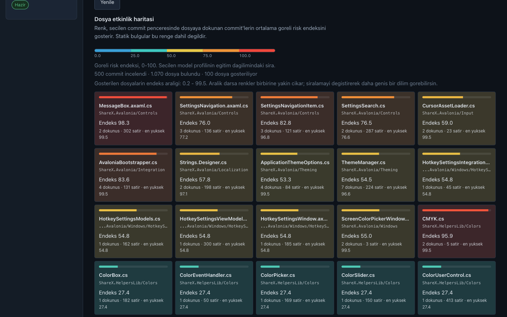
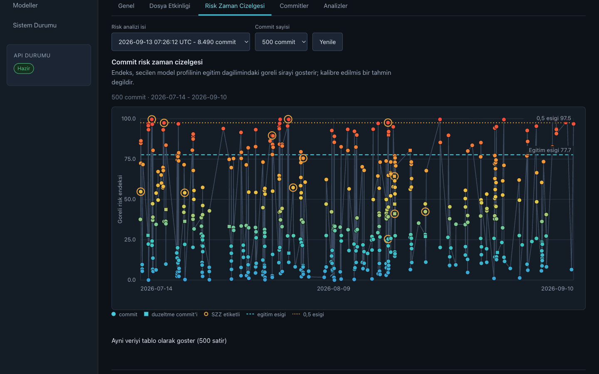
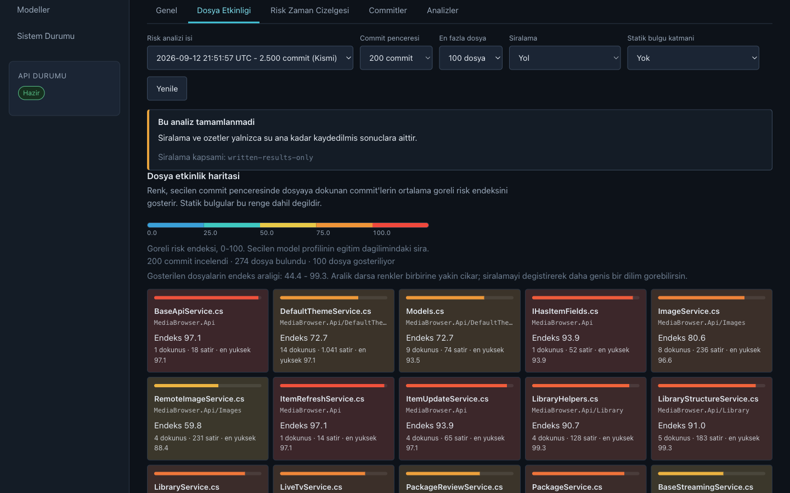
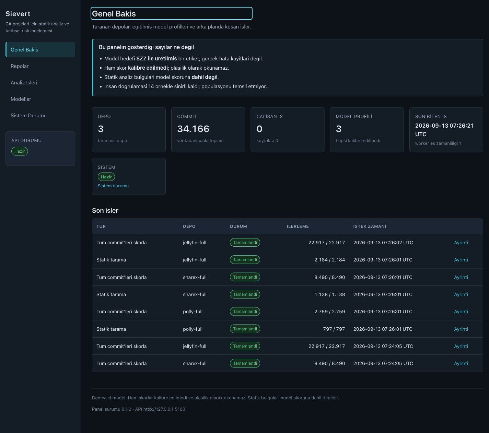
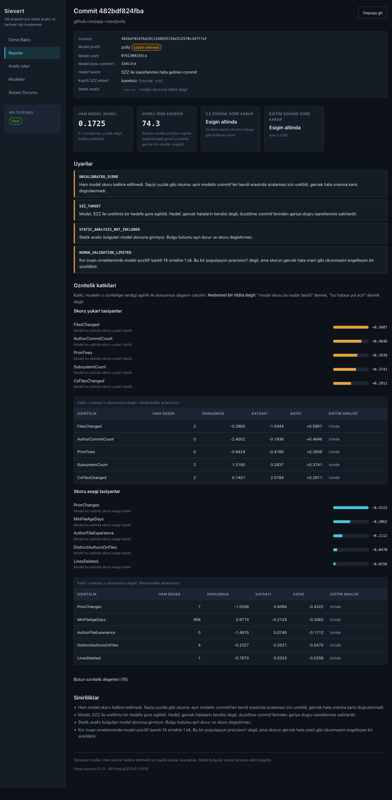
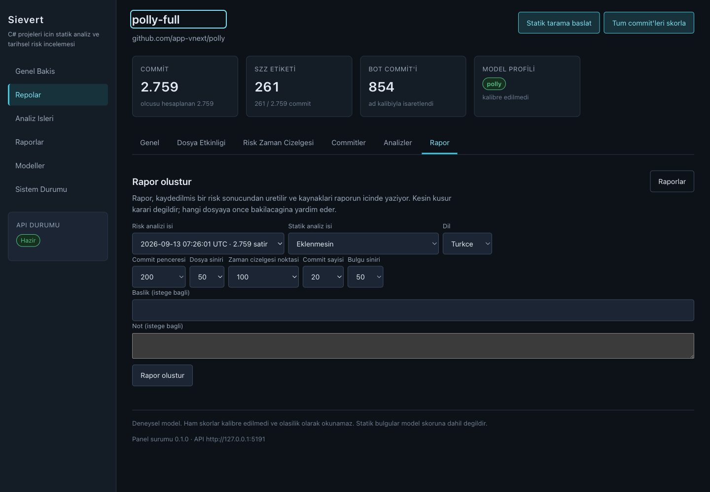
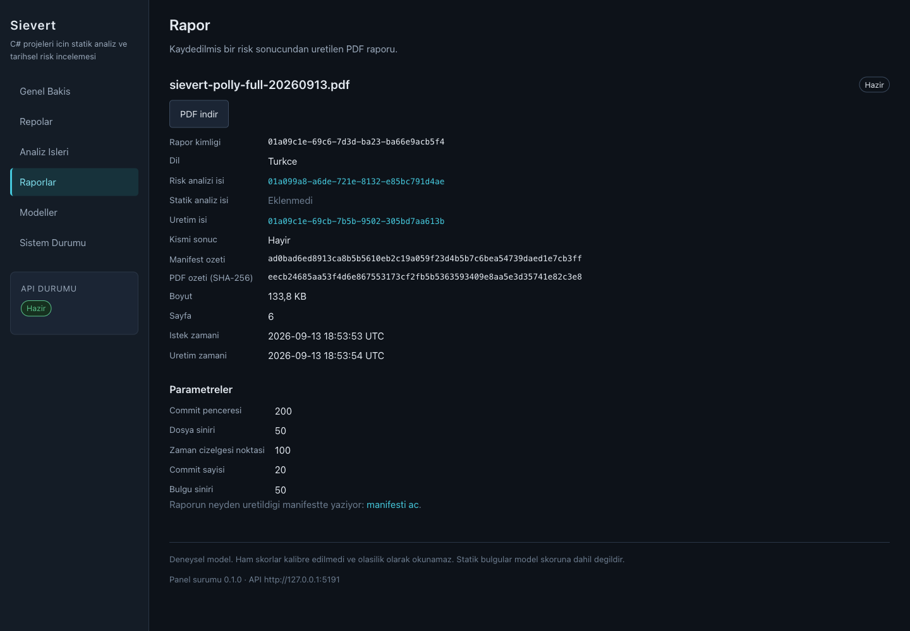

# Sievert

A command line tool that looks at a .NET repository and estimates how risky each commit is.

## The problem

When you review a commit, you only see the diff. The code usually looks fine, because
people don't write obviously broken code on purpose. But part of the risk isn't in the
code at all - it's in the history of the file you are touching. A file that has been
fixed five times in the last two months, or that a lot of different people keep editing,
is more likely to break again. That information is sitting in git, it's just not in front
of you while you are reviewing.

## Approach

Two sources of signal. They are **not** merged into a single number - the model score and
the static findings are reported separately, and combining them is a decision I have not
made yet:

- **Roslyn** parses the C# code and looks for .NET specific patterns that tend to cause
  bugs (things like async usage, disposal, null handling).
- **Git history** gives change signals for the files in the commit: how often they change,
  how many different authors touch them, how many past fixes they were part of.

The output is a risk score with a short explanation of why it came out that way. The
explanation matters more than the number - a score you can't question isn't useful.

## Project structure

```
Sievert.slnx                  solution file (new .slnx format, .NET 10)
Directory.Build.props         shared build settings for all projects
global.json                   pins the SDK version
src/
  Sievert.Core/               shared models and helpers, depends on nothing
  Sievert.Analysis/           code analysis with Roslyn
  Sievert.Mining/             git history with LibGit2Sharp, separate from Analysis
  Sievert.Data/               PostgreSQL with EF Core, separate from Mining
  Sievert.Modeling/           feature transform, logistic regression, model registry
  Sievert.Contracts/          DTOs and error codes shared by the API and the panel
  Sievert.Api/                ASP.NET Core Web API: read-only endpoints + background jobs
  Sievert.Web/                Blazor panel, talks to the API over HTTP only
  Sievert.Cli/                console app, this is what you run
tools/
  Sievert.Demo/               one-command demo: container, seed, API, panel
  Sievert.Measure/            measurement and verification tools
tests/
  Sievert.Tests/              xUnit tests
  Sievert.Web.Tests/          bUnit tests for the panel components
samples/Patients/             sample repositories to test against
docs/adr/                     short notes on why things were decided this way
docs/proje-notlari.md         working notes: goal, technical decisions, conventions
```

## Getting started

You need the .NET 10 SDK. The exact version is pinned in `global.json`.

```bash
git clone <repo-url>
cd sievert
dotnet build
dotnet test
dotnet run --project src/Sievert.Cli
```

Right now there are five commands. `sievert scan <path>` reads the C# files under a path
and prints the types and methods it found as a tree, with a summary at the end.
`sievert check <path>` runs the rules instead and prints each finding as a diagnostic
card; it exits with 1 if it finds anything at or above the `--fail-on` level (warning by
default). Both of those take `--json` as a flag and print to the screen.

`sievert mine <repo-path>` is the third one and it does something different: it walks a
git repository's history and pulls out what each commit did - author, date, message,
which files changed and by how many lines. It prints a summary and, if you give it
`--out <file>`, writes the full data to that file as JSONL, one commit per line. That
flag is deliberately not called `--json`: on the other two commands `--json` is a flag
that changes what gets printed, and one name meaning two things is the kind of thing
that breaks a script quietly.
`--since <date>` and `--max-commits <n>` limit how much history it reads. Merge commits
are left out of the data but counted in the summary. Why it works this way is in ADR 0011.

With `--db` the same pass also writes to PostgreSQL. Running it twice on the same
repository does not duplicate anything: commits already stored are skipped, and the
summary says how many. `--overwrite` deletes what is there and writes again. Derived
metrics are not computed yet - there is a `CommitMetrics` table but it is empty on
purpose, stage 4 step 3 fills it. The schema and why it looks like this are in ADR 0012.

`sievert metrics <repo-name>` is the last one. It reads the raw commit data back out of
the database and computes fifteen numbers per commit - how big the change was, how spread
out it was (Shannon entropy over the changed lines), how much history the touched files
already had, how experienced the author was on those files, and whether the message looks
like a bug fix. It does not go back to git. Every number is computed from what came
*before* that commit only; if information from later commits leaked in, stage 5 would
train a model that looks good and is not. `--out <file>` writes the min, median, p95 and
max of each metric as JSON. The definitions are in ADR 0013.

`sievert label <repo-name>` is where the labels come from. It takes every commit whose
message looks like a fix, finds the `.cs` lines that fix deleted, and runs git blame on
the parent version to see who wrote them last; those commits get marked as bug
introducing. That is the SZZ method. On Polly it labelled 272 of 2759 commits (9.9%),
which is just under the 10-30% you see in the literature - the funnel explaining why is
in `docs/olcumler/asama4-szz.md`. Two things worth knowing before trusting it: none of
the labels have been checked by hand, and blame in LibGit2Sharp does not follow renames,
which matters for 65% of the files involved. ADR 0014 has the rest.

The whole pipeline has been run over three repositories - Polly, ShareX and Jellyfin, the
same commits as in stage 3 - and the numbers are in `docs/olcumler/asama4-uc-repo.md`,
together with seven health checks against git itself. That run is also where a real bug
turned up: blame line numbers were off by one, so SZZ was blaming the line below the one
that changed. It is fixed, there is a regression test, and the old numbers are kept with
a note saying why they are wrong.

Across the three repositories SZZ labelled 5962 commits. The share varies a lot by
repository - 9.5% on Polly, 11.9% on ShareX, 20.5% on Jellyfin - and only the last one
sits in the middle of the 10-30% band the literature reports. The reason is not the
method but what the repositories look like: on Polly nearly a third of the fix commits
do not touch C# at all, on Jellyfin about a tenth do.

### Setting up the database

```bash
docker run -d --name sievert-db -p 5433:5432   -e POSTGRES_USER=sievert -e POSTGRES_PASSWORD=<your-password> -e POSTGRES_DB=sievert postgres:17
export SIEVERT_DB="Host=localhost;Port=5433;Database=sievert;Username=sievert;Password=<your-password>"
dotnet tool restore && dotnet dotnet-ef database update --project src/Sievert.Data
```

The connection string is never written into the code. The tool reads `SIEVERT_DB` first,
then `ConnectionStrings:Sievert` in an `appsettings.json` in the working directory; if
neither is there it says so and exits with 2. It also will not migrate your database on
its own - if the schema is out of date it prints the command and stops.

The database tests use Testcontainers and start a real PostgreSQL container. If Docker is
not running they are skipped, and `dotnet test` reports them as skipped rather than
passing quietly.

If a rule is wrong about one particular line, you can silence it there:

```csharp
// sievert:disable SV004 this list is in memory, not a database query
_ = items.Any();
```

The reason is required - without one the suppression does not count and the tool reports
it as a finding of its own (SV007). Suppressions only cover the line right after the
comment, there is no file-wide version, and every suppressed finding is counted in the
summary and listed in `--json`. Why it works this way is in ADR 0015.

There are seven rules:

| Code | Severity | What it looks for |
|---|---|---|
| SV001 | error | `async void` methods that aren't event handlers |
| SV002 | warning | blocking on a task with `.Result`, `.Wait()` or `.GetAwaiter().GetResult()` |
| SV003 | warning | a call whose returned task is dropped on the floor |
| SV004 | warning | a query-looking call inside a loop body (N+1) |
| SV005 | warning | a `new` of something disposable that never gets disposed |
| SV006 | info | a public `Task` method with no `CancellationToken` parameter |
| SV007 | warning | a `// sievert:disable` comment with no reason written after it |

All of them decide what things are by looking at names, because there is no semantic model
yet. That produces false positives, which is a trade I took on purpose -
`docs/adr/0010-ad-temelli-tespit-ve-kabul-edilen-yanlis-pozitifler.md` explains the trade
and `docs/sinirliliklar.md` lists what goes wrong in each direction, rule by rule.

Not all six run by default. SV003 and SV005 are off unless you turn them on in
`sievert.json`. The default set is not "everything I have written" - it is the set whose
precision I actually measured. I checked five findings per rule by hand on a real
repository (`docs/olcumler/asama3-precision.md`): SV003 and SV005 came out at 0%, so
leaving them on would mean half of what the tool prints is noise. SV004 also came out
below the threshold I had set in advance (20%), but its false positives all trace to one
cause I can fix, so it stays on for now.

I have since written those fixes (the numbers are in
`docs/olcumler/asama3-duzeltme-sonrasi.md`): Jellyfin went from 878 findings to 714 and
ShareX from 559 to 363. That is a count, not a precision number - I did not re-check the
findings by hand, so SV003 and SV005 stay off by default until someone measures them
again on a fresh sample.

If you want the other two, put them in your config file:

```json
{ "rules": [ { "code": "SV003" }, { "code": "SV005" } ] }
```

The summary always prints which rules ran and which ones are off, so a narrowed default
set is never silent.

SV006 is `info` rather than a warning on purpose. It fires on nearly every async method in
a codebase that never thought about cancellation, and `--fail-on` defaults to `warning`, so
it shows up in the output without breaking anyone's build.

Both commands also take `--exclude <pattern>`, and you can pass it more than once. `*`
matches inside one path segment and `**` matches zero or more segments, so patterns look
like this:

```bash
dotnet run --project src/Sievert.Cli -- check . --exclude 'samples/**' --exclude '**/*.Designer.cs'
```

Quote the pattern. Without quotes your shell expands it before the tool sees it, and
`samples/**` turns into `samples/Patients`, which matches nothing. A pattern that cannot
be parsed is a usage error and exits 2, rather than being skipped silently. The summary
always prints how many files were excluded, so you can tell a working pattern from a typo.

`bin`, `obj`, `.git` and `node_modules` are never scanned at all, so you do not need a
pattern for them. They are not counted in the excluded number either.

CI runs `check` on this repository itself, right after the tests, so the tool has to pass
its own rules:

```bash
dotnet run --project src/Sievert.Cli -- check .
```

There is no flag on that line because this repository has its own `sievert.json` at the
root, and the tool reads it the same way it would read yours. `samples/` is excluded there
because those files are broken on purpose - they are test data the test project reads.

## Configuration

`sievert.json` is optional. If there is one in the directory you are scanning it gets read;
if there isn't, every rule runs and nothing is excluded. `--config <path>` points at a
different file, and in that case the file has to exist. `--config` is resolved against your
current working directory, not against the directory being scanned.

```json
{
  "rules": [
    { "code": "SV001", "enabled": true, "severity": "warning" }
  ],
  "exclude": ["samples/**"]
}
```

The file only turns rules on and off and overrides how serious their findings are. What a
rule actually looks for stays in the code - see `docs/adr/0009-kural-katalogu-ve-yapilandirma.md`
for why. `severity` is applied before `--fail-on` is checked, so setting a rule to `info`
really does stop it from breaking the build.

Rules you don't mention keep running with their defaults, so adding a new rule later
doesn't get silently disabled by an old config file. A rule code the tool doesn't know, or
a property name it doesn't know, is an error and exits 2 - a typo shouldn't quietly turn a
rule off. `exclude` here and `--exclude` on the command line are added together; neither
replaces the other.

The summary prints which rules ran and which ones the config turned off, how many files
were excluded, and how many directories were never entered at all:

```
Ozet
  Taranan dosya  : 67
  Dislanan dosya : 11
  Atlanan klasor : 9
  Etkin kural    : SV001, SV002, SV003, SV004, SV005, SV006, SV007
  Kapali kural   : yok
  Bulgu          : 0  (hata 0 / uyari 0 / bilgi 0)
```

`--json` carries the same information, with the skipped directories listed by path.

Exit codes are the same for both commands:

| Code | Meaning |
|---|---|
| 0 | ran fine, nothing at or above the `--fail-on` level |
| 1 | ran fine, found something at or above that level |
| 2 | the tool could not run: path not found, bad flag, unexpected error |

## Roadmap

0. Project scaffolding, CI, ADRs — done
1. Roslyn syntax tree traversal: read a C# file as structure, not text — done
2. First detector: SV001 async void — done
3. Detector catalogue: 6 .NET-specific defect patterns behind an IRule
   plugin interface, configured from JSON — written, not measured yet
4. Git history mining with LibGit2Sharp: churn, ownership, past fixes,
   simplified SZZ labelling, stored in PostgreSQL via EF Core
5. Risk engine: weighted baseline, then ML.NET classifier, then
   calibration (Brier, ECE, reliability diagram) — the research core
6. ASP.NET Core Web API + Blazor dashboard — read-only API and the commit risk
   endpoint are done, the dashboard is not started
7. GitHub Action bot that comments risk on pull requests
8. Test suite, Docker Compose, evaluation on real open-source C# repos

## Status

Early development, v0.1.0. Stages 0 to 3 are done and stage 4 has started. The project builds with CI, Roslyn
parsing reads a file as structure, and the first rule SV001 runs behind the `check`
command. SV001 was measured on two real repositories (Polly and ShareX) and a 20-line
sample of its output was checked by hand: precision came out 8/10, with two false
positives and one false negative that all trace back to the same cause. The numbers and
what I plan to do about them are in `docs/raporlar/asama2-kapanis.md`. Stage 3 has
started: SV001 now also treats `+= MethodName` in the same file or the same partial class
as evidence that a method is an event handler (ADR 0008), there is an `--exclude` flag, CI
checks this repository with it, and rules live in a catalogue that an optional
`sievert.json` can turn on and off (ADR 0009). All six detectors for stage 3 are written
and all six have now been run on three real repositories - Polly, ShareX and Jellyfin -
with the numbers in `docs/olcumler/`. Thirty of those findings, five per rule, were then
checked by hand against the source: overall precision came out 15/30, and the per-rule
table is in `docs/olcumler/asama3-precision.md`. Three of the rules had a single fixable
cause behind their false positives; those fixes are written and the before/after counts
are in `docs/olcumler/asama3-duzeltme-sonrasi.md` (Jellyfin dropped from 878 findings to
714). Precision was not measured again after the fixes, so the 15/30 above is still the
only precision number this project has.

Stage 4 has started with git history. There is a `mine` command that walks a repository's
commits and writes one JSON object per commit to a file; it does not touch a database yet.

### Stage 5 result

Stage 5 built the risk model on a frozen snapshot of 34 166 commits from three C# repos
(Polly, ShareX, Jellyfin), split in time order per repository: 23 915 train, 10 251 test.
Three logistic regression models, one per repo, 15 commit features, no class weighting.

Against the `LinesAdded` threshold baseline the model reached micro F1 0,4408 (baseline
0,3754), macro F1 0,3088 (baseline 0,2999) and micro PR-AUC 0,4775 (baseline 0,2611), so
it passed all three conditions that were declared before the measurement. A paired
circular moving-block bootstrap (2000 repeats) put the micro delta F1 interval at
[0,0485, 0,0823] and the micro delta PR-AUC interval at [0,1818, 0,2513], both above the
baseline; the macro delta F1 interval [-0,0296, 0,0563] contains zero. So the model beats
the baseline in the volume-weighted totals, and at the per-repository level the difference
is not separated from noise — in Polly its F1 (0,2500) is below the baseline (0,2667).

Three repositories is not enough to say anything general about transfer: of six
single-source cross-repo directions, three land above the target's own model and three
below. Calibration was measured but stays experimental — Platt and isotonic both lowered
micro Brier and ECE, both gave a mixed result on Jellyfin, and no calibrator was picked
for production, so the probabilities are uncalibrated.

Thirty test predictions were checked by hand, blind to the model output and the SZZ label;
25 were decided. Within that sample, the human-validation precision signal was 1/14 and
the miss signal 1/11. These are sample-bound signals, not the model's precision or recall.

Numbers and their sources: `docs/raporlar/asama5-kapanis.md`.

### Stage 6 so far

Steps 0 to 4 of stage 6 are done: the product-language contract, a read-only Web API, the
commit risk endpoint, persistent background jobs with progress and cancellation, and a
Blazor panel. Heat maps, the risk timeline, report export and authentication are **not**
written. The roadmap is in `docs/planlar/asama6-api-ve-panel.md`.

## The API

`src/Sievert.Api` serves the three trained models over HTTP. Reads are the bulk of it; the
only write is starting or cancelling a background job. There is still no repository
cloning and no history mining behind the API.

```bash
export SIEVERT_DB="Host=localhost;Port=5433;Database=sievert;Username=sievert;Password=..."
dotnet run --project src/Sievert.Api
```

There is **no authentication**. Because of that the API only listens on loopback by
default: if you point it at `0.0.0.0`, `*` or a real address it refuses to start and tells
you why. You can open it with `SIEVERT_ALLOW_REMOTE=true`, but anyone who can reach the
address can then use every endpoint, so that is experimental and unsafe.

It listens on the ASP.NET Core default ports and serves an OpenAPI document at
`/openapi/v1.json`.

The model files and the score reference live in `data/`, so the API looks for them by
walking up from its content root until it finds `Sievert.slnx`. That is why the command
above works even though `dotnet run --project` sets the content root to the project
folder. If it cannot find them it says so and stops instead of failing on the first
request; you can point it somewhere else with `Sievert:ArtifactRoot`.

| Endpoint | What |
|---|---|
| `GET /api/v1/health` | database state and the status of each model profile |
| `GET /api/v1/models` | the three trained profiles and their limitations |
| `GET /api/v1/repositories` | mined repositories, paged |
| `GET /api/v1/repositories/{id}` | one repository with its label counts |
| `GET /api/v1/repositories/{id}/commits` | commits, newest first, paged |
| `GET /api/v1/repositories/{id}/commits/{sha}/risk` | model assessment for one commit |
| `POST /api/v1/repositories/{id}/analyses` | start a background job |
| `GET /api/v1/analyses/{jobId}` | job status and progress |
| `GET /api/v1/repositories/{id}/analyses` | a repository's jobs, paged |
| `POST /api/v1/analyses/{jobId}/cancel` | cancel a job |
| `GET /api/v1/analyses/{jobId}/findings` | a static scan job's findings |
| `GET /api/v1/analyses/{jobId}/risks` | a risk scoring job's commit assessments |
| `GET /api/v1/repositories/{id}/visualizations/file-activity` | per-file summary over a commit window |
| `GET /api/v1/repositories/{id}/visualizations/risk-timeline` | risk index per commit, newest last |
| `POST /api/v1/repositories/{id}/reports` | start a PDF report from a finished risk job |
| `GET /api/v1/repositories/{id}/reports` | a repository's reports, paged |
| `GET /api/v1/reports/{reportId}` | report status, checksum, page count |
| `GET /api/v1/reports/{reportId}/manifest` | the report's canonical input manifest |
| `GET /api/v1/reports/{reportId}/download` | the PDF itself, verified before it is sent |

### What the risk endpoint does and does not say

The response carries four separate numbers and none of them replaces another:

- `rawModelScore` — the model's raw output. **Not a calibrated probability.** No
  calibrator was picked for production, so this number must not be read as a percentage.
- `decisionAt05` — the decision at the 0.5 threshold.
- `decisionAtTrainThreshold` — the decision at the threshold picked on that repo's
  training split, which is also returned as `trainThreshold`.
- `riskIndex` — where this score sits in the training score distribution, 0 to 100. This
  is **not** `rawModelScore * 100`, and indexes from different profiles cannot be
  compared with each other.

There is no `probability` field and no combined static-plus-model score. Static analysis
findings sit in their own section with `status: "not-run"` and
`includedInModelScore: false`; an empty list means "did not run", not "found nothing".

Every assessment carries at least four warnings: the score is uncalibrated, the target
came from SZZ, static analysis is not part of the score, and human validation was
limited. Commits that touch no C# file get a coverage warning on top, because no commit
in that group is labelled positive in the training data.

Repositories outside the three training repos are not scored at all — the API returns
`422` rather than silently picking a profile, because cross-repo transfer was measured
and came out inconsistent (ADR 0021).

Feature contributions are checked against the model's own logit before they are returned.
If they disagree the API returns `MODEL_EXPLANATION_MISMATCH` instead of an explanation.
This gate fires on 11 of 34 166 commits; the reason and what I did not do about it are in
`docs/olcumler/asama6-api-temel.md`.

The full contract is `docs/urun/risk-sozlesmesi.md` and the reasoning is in ADR 0023.

Feature contributions are checked against the model's own logit before they are returned,
with a tolerance that scales with the size of the terms being summed rather than a fixed
absolute number — the reason is in `docs/urun/model-aciklama-sayisal-tolerans.md`. Over
all 34 166 commits the check now passes everywhere, and a deliberately corrupted
explanation is still rejected by a wide margin.

There is no way to ask for a different model profile. The repository decides: a known
repository gets its own profile, an unknown one is not scored at all.

### Background jobs

Two things take too long for a single request: scanning a repository's working tree, and
scoring every commit in it. Both run as background jobs.

A static scan only runs on a **clean working tree**. If there are uncommitted changes the
job fails immediately with `REPOSITORY_WORKTREE_DIRTY`; the names of the changed files are
not returned, only how many there are. The job records the HEAD commit it scanned and
checks it again when the scan finishes, so a result that was produced while somebody was
checking out a different branch is never reported as complete.

```bash
# start a job
curl -i -X POST http://127.0.0.1:5000/api/v1/repositories/2/analyses \
  -H "Content-Type: application/json" \
  -H "Idempotency-Key: my-key-1" \
  -d '{"kind":"static-scan"}'

# follow it (the Location header from the response above)
curl http://127.0.0.1:5000/api/v1/analyses/<jobId>

# cancel it
curl -X POST http://127.0.0.1:5000/api/v1/analyses/<jobId>/cancel

# results
curl "http://127.0.0.1:5000/api/v1/analyses/<jobId>/findings?pageSize=100"
curl "http://127.0.0.1:5000/api/v1/analyses/<jobId>/risks?order=highest-risk"

# the two visualization endpoints (they need a finished risk-score-all job)
curl "http://127.0.0.1:5000/api/v1/repositories/2/visualizations/file-activity\
?analysisJobId=<jobId>&commitWindow=200&limit=100&sort=mean-risk-desc"
curl "http://127.0.0.1:5000/api/v1/repositories/2/visualizations/risk-timeline\
?analysisJobId=<jobId>&count=100"

# a PDF report: start it, wait for it, download it
curl -i -X POST http://127.0.0.1:5000/api/v1/repositories/2/reports \
  -H "Content-Type: application/json" -H "Idempotency-Key: $(uuidgen)" \
  -d '{"riskAnalysisJobId":"<jobId>","staticAnalysisJobId":"<scanId>","culture":"tr-TR"}'

curl http://127.0.0.1:5000/api/v1/reports/<reportId>
curl http://127.0.0.1:5000/api/v1/reports/<reportId>/manifest
curl -O -J http://127.0.0.1:5000/api/v1/reports/<reportId>/download
```

`kind` is either `static-scan` or `risk-score-all`. Starting a job returns `202` with a
`Location` header; sending the same `Idempotency-Key` again returns the same job with
`200` instead of opening a second one.

The job itself lives in the database, not in the queue. If the process dies while a job is
running, the job does not silently resume on the next start: it is marked `failed` with
`PROCESS_INTERRUPTED`, because we do not know where it stopped and finishing a half-done
job as if it were complete is worse than failing it. Jobs that were still queued are put
back on the queue.

A cancelled or failed job keeps the rows it already wrote, but they are never presented as
a complete result: the response carries `isResultComplete: false`, `partial: true` and a
warning saying so.

The path to scan comes from the repository record, not from the request body. There is no
endpoint that takes a filesystem path, because there is no authentication either.

The reasoning behind all of this is in ADR 0024, and the measurements are in
`docs/olcumler/asama6-arka-plan-isleri.md` and `docs/olcumler/asama6-bellek-ayristirma.md`.

## The panel

`src/Sievert.Web` is a Blazor Web App (Interactive Server). It reads everything from the
API over HTTP and has **no project reference** to `Sievert.Api`, `Sievert.Data` or
`Sievert.Modeling` - so "the panel does not compute anything itself" is enforced by the
compiler, not by good intentions.

Running it needs four things in order:

```bash
# 1. PostgreSQL (the same container the CLI uses; see the command above)
docker start sievert-db

# 2. migrations
export SIEVERT_DB="Host=localhost;Port=5433;Database=sievert;Username=sievert;Password=..."
dotnet ef database update --project src/Sievert.Data --startup-project src/Sievert.Data

# 3. the API
dotnet run --project src/Sievert.Api --urls http://127.0.0.1:5000

# 4. the panel, in another terminal
export SIEVERT_API_URL="http://127.0.0.1:5000"
dotnet run --project src/Sievert.Web --urls http://127.0.0.1:5001
```

Then open `http://127.0.0.1:5001`. `SIEVERT_API_URL` defaults to `http://127.0.0.1:5000`,
so you can leave it out if you use that port.

The panel has **no authentication either** and listens on loopback by default, with the
same `SIEVERT_ALLOW_REMOTE=true` escape hatch and the same warning: anyone who can reach
the address can use it.

Pages: overview, repositories, repository detail (with a file activity map and a risk
timeline), analysis jobs, job detail (with the result list), commit risk, models and
system status. Job progress is polled once a second
and stops as soon as the job reaches a terminal state; there is no SignalR push yet.

### What the panel says about the numbers

The panel repeats the risk contract rather than softening it:

- The raw model score is shown with four decimals and **no percent sign**. It is not a
  calibrated probability and a percent sign is the shortest way to make it look like one.
- `RiskIndex` is shown as a relative index with the sentence explaining that it is a
  percentile inside the training distribution.
- The two decisions (at 0.5 and at the training threshold) are separate cards. Nothing is
  merged into a single "risk" number.
- Static findings are a separate card and every view of it says they are not part of the
  model score.
- Every model profile carries an "not calibrated" badge.
- A cancelled or failed job's rows are shown, but under a warning saying the result is
  incomplete.

### The file activity map and the risk timeline

The repository page has two tabs that draw the same numbers the tables already show.





There is no chart library and no CDN script: the timeline is SVG written by C# and the
map is a CSS grid. Everything works offline.

**What the colour means.** A cell's colour does **not** say the file is faulty. It
summarises the *relative risk indices of the commits that touched that file* inside the
chosen commit window - by default the mean. Three things keep that readable:

- the index is printed as a number in every cell, so the colour is never the only signal;
- the legend says the index is relative to the training distribution;
- there is no percent sign anywhere, because the raw score is not a calibrated
  probability.

**Static findings are separate.** If you pick a static scan job as an overlay, files with
findings get a badge. The badge does not change the colour or the order, and the detail
panel says so in words: static findings are not part of the model score.

**Partial results are labelled.** Every response carries a ranking scope. If the job was
cancelled after writing some rows, the scope is `written-results-only`, the response
carries a `PARTIAL_ANALYSIS_RESULT` warning and the panel shows a banner - because the
"top 100 files" of a partial job is not the top 100 of the full one.



The commit window (10-1000, default 200), the file limit (10-200, default 100) and the
timeline point count (10-500, default 100) are all in the query string, so a view can be
shared as a link. The timeline's X axis is scaled by commit date, so gaps in time show up
as gaps in the line. If every commit in the window happens to share one timestamp there is
no span to scale by; the chart falls back to ordinal positions, the response carries a
`TIMELINE_USES_ORDINAL_AXIS` warning and the page says it in words.

The decisions behind all of this are in ADR 0026, the numbers in
`docs/olcumler/asama6-gorsellestirme.md`, and the independent recomputation from the raw
tables in `data/asama6/gorsellestirme-dogrulama.json` (30 files, 150 points, 0
differences).





More screenshots are in `docs/images/asama6/`. The decisions are in ADR 0025 and ADR
0026, the measurements in `docs/olcumler/asama6-panel-temel.md` and
`docs/olcumler/asama6-gorsellestirme.md`.

### The PDF report

The repository page has a **Rapor** tab. Pick a finished risk job, optionally a static
scan, and the panel starts a background job that writes a PDF.

The report is a technical review summary - **not** an audit document and not a defect
verdict. The cover says so, and it carries three sentences that never move off the first
page: the raw score is not a calibrated probability, the risk index is a relative
percentile, and static findings are not part of the model score.

What makes it auditable:

- Every report has a **canonical input manifest**: repository, job, model, parameters and
  evidence checksums, as one canonical JSON document. The same data and the same
  parameters produce the same bytes and the same SHA-256. The generation time is
  deliberately *not* part of it, otherwise the checksum could never repeat.
- The manifest checksum is printed inside the PDF and served at
  `/api/v1/reports/{id}/manifest`.
- The PDF's own SHA-256 cannot be printed inside itself (writing it would change the
  file), so it is served in the metadata and in the download's `ETag`. The report says
  this in plain words rather than leaving a gap.
- The file is written to a temporary name, hashed, then moved atomically. Before every
  download the size and hash are checked again; if they do not match, the artifact is
  marked `corrupted` and nothing is sent.
- Sending the same `Idempotency-Key` with the same body returns the same report and the
  same bytes - no second job.

A partial (cancelled) job can only be reported with an explicit `includePartial=true`,
and then every section of the PDF says that it covers only the rows that were written.





An example, produced from the demo data set:
[`docs/demo/sievert-polly-ornek-rapor.pdf`](docs/demo/sievert-polly-ornek-rapor.pdf)
(checksum next to it).

The numbers in the PDF are verified independently: a separate tool extracts the text from
the PDF with its own extractor and recomputes every value from the raw tables. Three
reports, 125 checks, **0 differences** (`data/asama6/rapor-dogrulama.json`).

### One command demo

```bash
dotnet run --project tools/Sievert.Demo
```

That starts a temporary PostgreSQL container, applies the migrations, imports a fixed
demo data set, starts the API and the panel on free loopback ports, waits until both
answer, prints the addresses and opens the browser. Ctrl+C shuts everything down: panel,
then API, then the container.

You need the .NET 10 SDK, a running Docker and the `postgres:17` image. With those three
present it works **without an internet connection**. Measured startup: 7.8-10.3 seconds
over five runs (`docs/olcumler/asama6-rapor-ve-demo.md`).

Useful flags: `--no-open`, `--keep-database`, `--api-port`, `--web-port`, `--smoke-test`
(start, check, shut down, exit code), `--verbose`.

**The demo data is real, and it is a subset.** It is the newest 200 commits of the public
Polly history with their real metrics, labels, risk scores and static findings - no
invented rows. The selection rule was fixed before looking at any result, and the panel
shows a banner saying this is a fixed public subset rather than a live analysis. The
source manifest (`data/asama6/demo/source-manifest.json`) records where it came from.

One property of that subset is worth stating: it has **zero SZZ-positive commits**,
because the newest commits have not been fixed yet (right censoring), and 172 of the 200
are bot commits. That was not a reason to change the rule - the demo shows how the tool
works, not how good the model is.

The walkthrough is in `docs/demo/asama6-demo-senaryosu.md`, the decisions in ADR 0027.
